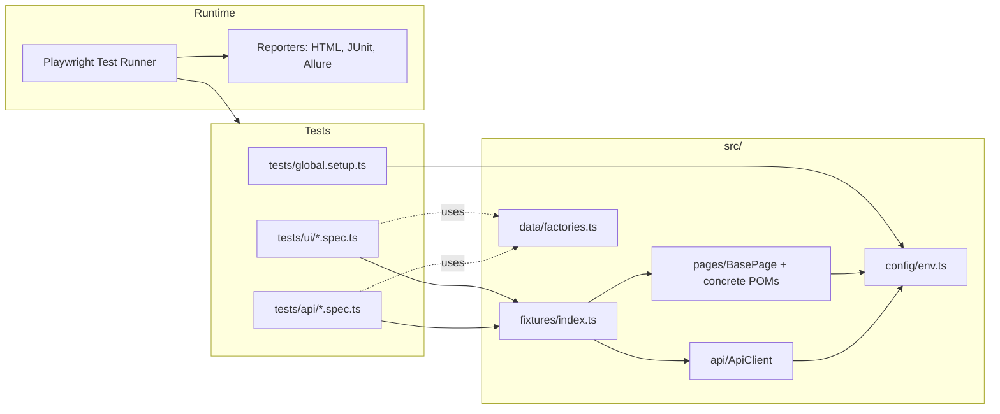

# playwright-ts-framework

Production-grade Playwright + TypeScript test automation framework — designed for parallel CI execution, multi-environment testing, and minimal flakiness.

[](.github/workflows/playwright.yml)
[](tsconfig.json)
[](package.json)
[](LICENSE)

---

## Why this exists

Most "Playwright starter" repos stop at `npx playwright install` — one config file, one example test, no separation of concerns. This repository is the opposite: it is the structure I reach for when building real test suites for fintech and SaaS clients, distilled into a template.

It is opinionated about the things that matter once a suite grows past a hundred tests:

- Page objects with a real base class, not loose helper functions
- Fixtures that compose pages and API clients per-test, not module-level singletons
- A typed environment loader so `dev` / `staging` / `prod` are first-class, not ad-hoc env vars
- Test data generated by factories, never hard-coded inline
- API client built on Playwright's `APIRequestContext` so UI and API tests share auth state
- Browser projects, an `api` project, and a `setup` project — each isolated and parallelized
- Reporters that survive CI: HTML for humans, JUnit for the build system, Allure for trend reports

---

## Architecture



---

## Tech stack

| Layer         | Tool                                                       |
| ------------- | ---------------------------------------------------------- |
| Test runner   | `@playwright/test`                                         |
| Language      | TypeScript (strict mode)                                   |
| Reporting     | Playwright HTML, JUnit, Allure                             |
| Lint / format | ESLint (typescript-eslint, plugin-playwright) + Prettier   |
| Pre-commit    | Husky + lint-staged (lint + typecheck on staged files)     |
| Env loader    | `dotenv` + a typed config module                           |
| CI            | GitHub Actions (matrix: chromium / firefox / webkit / api) |

---

## Project structure

```
.
├── .github/workflows/      # CI: lint + tests on PR, nightly cron
├── src/
│   ├── api/                # Typed API client (Playwright APIRequestContext)
│   ├── config/             # Environment loader (dev/staging/prod)
│   ├── data/               # Factories + shared types
│   ├── fixtures/           # Custom Playwright fixtures (pages + API clients)
│   └── pages/              # Page objects (BasePage + concrete pages)
├── tests/
│   ├── api/                # API-only specs (project: "api")
│   ├── ui/                 # E2E specs (projects: chromium/firefox/webkit)
│   └── global.setup.ts     # Pre-flight environment check
├── playwright.config.ts    # Projects, reporters, parallelism, timeouts
├── tsconfig.json
├── eslint.config.mjs
└── .env.example
```

---

## Getting started

```bash
npm ci
npx playwright install
cp .env.example .env
```

Then run the full suite:

```bash
npm test
```

---

## Running tests

| Command                                                        | What it does                           |
| -------------------------------------------------------------- | -------------------------------------- |
| `npm test`                                                     | Full suite, all projects               |
| `npm run test:smoke`                                           | Tests tagged `@smoke` (fastest signal) |
| `npm run test:regression`                                      | Tests tagged `@regression`             |
| `npm run test:api`                                             | Tests tagged `@api`                    |
| `npm run test:ui`                                              | Open Playwright UI mode                |
| `npm run test:debug`                                           | Debug mode with inspector              |
| `npx playwright test --project=chromium tests/ui/auth.spec.ts` | Single file on a single browser        |

### By environment

```bash
TEST_ENV=staging npm test       # macOS/Linux
$env:TEST_ENV='staging'; npm test   # PowerShell
```

`src/config/env.ts` validates `TEST_ENV` and surfaces typed `env.baseUrl`, `env.apiBaseUrl`, `env.user`, `env.admin`. Per-env URL/credential overrides go through `.env`.

---

## Reports

| Reporter | Where                    | When to use                            |
| -------- | ------------------------ | -------------------------------------- |
| HTML     | `playwright-report/`     | Local debugging — `npm run report`     |
| JUnit    | `test-results/junit.xml` | CI integrations (Jenkins, GitLab, etc) |
| Allure   | `allure-results/`        | Trend / history dashboards             |

Generate and open Allure locally:

```bash
npm run allure:serve
```

---

## Best practices applied

- **Page Object Model with a `BasePage`.** Common navigation, ready-state hooks, and element helpers live in one place; concrete pages declare locators in their constructors.
- **Fixtures over hooks.** Page and API clients are exposed as Playwright fixtures, so each test asks for exactly what it needs.
- **No hard waits.** Web-first assertions and `waitFor` only — `page.waitForTimeout` is treated as a smell.
- **`data-test` attributes as the test ID strategy.** Resilient to copy and styling churn; configured globally via `testIdAttribute`.
- **Parallel by default.** `fullyParallel: true`, with workers tuned per environment (CI sets a fixed count for predictable runtime).
- **Retries only in CI.** Local runs fail on first attempt so flakiness can't hide.
- **Trace + video + screenshots on failure only.** Cheap to keep, easy to debug from CI artifacts.
- **API client shares config with UI.** Same `env` module, same auth flow — no duplicated login logic.
- **Strict TypeScript.** `strict` plus `noUnusedLocals` and `noUnusedParameters` — failures caught at compile time, not test time.
- **Pre-commit gate.** `lint-staged` + `tsc --noEmit` block broken commits before they reach CI.

---

## Adapting to a new project

1. Point `BASE_URL` and `API_BASE_URL` (or extend `src/config/env.ts` with new envs) at your target.
2. Replace the page objects in `src/pages/` with yours — `BasePage` stays.
3. Update the `testIdAttribute` in `playwright.config.ts` if your app uses something other than `data-test`.
4. Keep the fixture, reporter, and CI configuration as-is — they are the parts that pay rent over time.

---

## License

MIT
